# Ops-Center

<div align="center">


### The AI Infrastructure Command Center

**Manage users, billing, LLMs, and services from one dashboard.**

[](https://github.com/Unicorn-Commander/Ops-Center-OSS/stargazers)
[](https://github.com/Unicorn-Commander/Ops-Center-OSS/network/members)

[](LICENSE)
[](https://python.org)
[](https://reactjs.org)
[](https://fastapi.tiangolo.com)

[Quick Start](#quick-start) · [Features](#features) · [Roadmap](#roadmap) · [Used in Production](#used-in-production) · [Documentation](#documentation)

</div>

---

## What is Ops-Center?

Ops-Center is an open source operations dashboard for AI infrastructure. It provides centralized management for users, subscriptions, LLM routing, and integrated services.

Think of it as your infrastructure control panel: user management, billing, API routing, and service orchestration in one place.

<p align="center">
  
</p>

---

## Why Ops-Center?

Building an AI SaaS typically requires stitching together a dozen services. Ops-Center consolidates them into one self-hosted platform.

### What It Replaces

<table>
<tr>
<th>Category</th>
<th>Ops-Center Feature</th>
<th>Replaces</th>
<th>Typical Cost</th>
</tr>
<tr>
<td></td>
<td>LiteLLM integration</td>
<td>OpenRouter, Portkey, Helicone</td>
<td>$50-500/mo + API markup</td>
</tr>
<tr>
<td></td>
<td>Keycloak SSO</td>
<td>Auth0, Okta, Clerk, Cognito</td>
<td>$100-1000+/mo</td>
</tr>
<tr>
<td></td>
<td>Lago + Stripe</td>
<td>Metronome, Orb, Amberflo</td>
<td>$500-2000+/mo</td>
</tr>
<tr>
<td></td>
<td>Built-in dashboards</td>
<td>Datadog, Splunk, Mixpanel</td>
<td>$100-1000+/mo</td>
</tr>
<tr>
<td></td>
<td>Rate limiting, keys</td>
<td>Kong, Apigee, AWS API Gateway</td>
<td>$200-500+/mo</td>
</tr>
<tr>
<td></td>
<td>Full admin UI</td>
<td>Retool, Appsmith, custom dev</td>
<td>$50-500/mo</td>
</tr>
<tr>
<td></td>
<td>Cloudflare + Namecheap</td>
<td>Multiple dashboards</td>
<td>Management overhead</td>
</tr>
<tr>
<td></td>
<td>Prometheus + Grafana</td>
<td>Datadog, Grafana Cloud</td>
<td>$50-500/mo</td>
</tr>
<tr>
<td></td>
<td>Self-service dashboard</td>
<td>Custom user portals, Stripe Portal</td>
<td>Dev time</td>
</tr>
<tr>
<td></td>
<td>Role-based access control</td>
<td>Permit.io, Oso, custom RBAC</td>
<td>$100-500/mo</td>
</tr>
<tr>
<td></td>
<td>Apps dashboard with SSO</td>
<td>Okta Dashboard, custom app portals</td>
<td>$50-200/mo</td>
</tr>
</table>

### Cost Comparison

<table>
<tr>
<td width="50%" valign="top">

**Without Ops-Center**

| Service | Monthly Cost |
|---------|-------------|
| Auth0 / Clerk | $200 |
| OpenRouter | API markup fees |
| Metronome / Orb | $500 |
| Datadog | $200 |
| Retool | $100 |
| Kong / API Gateway | $200 |
| Custom integration | Dev time |
| **Total** | **$1,200+ /mo** |

</td>
<td width="50%" valign="top">

**With Ops-Center**

| Component | Cost |
|-----------|------|
| Self-hosted | $0 |
| Your infrastructure | Your servers |
| No per-seat fees | $0 |
| No API markup | $0 |
| No vendor lock-in | $0 |
| **Total** | **$0 platform fees*** |

</td>
</tr>
</table>

<sub>*You pay only for your own infrastructure and any LLM provider API costs (OpenAI, Anthropic, etc.)</sub>

### What Makes It Different

<table>
<tr>
<td align="center" width="25%">

<br/><br/>
<strong>BYOK Support</strong><br/>
Let users bring their own API keys. No platform markup. Unique feature most platforms lack.
</td>
<td align="center" width="25%">

<br/><br/>
<strong>Unified System</strong><br/>
Credit system tied directly to LLM usage with automatic cost tracking per user and org.
</td>
<td align="center" width="25%">

<br/><br/>
<strong>Dynamic Access</strong><br/>
Apps appear based on subscription tier. Database-driven, no code deploys needed.
</td>
<td align="center" width="25%">

<br/><br/>
<strong>One Interface</strong><br/>
DNS, users, billing, LLMs, services. One dashboard instead of 10 browser tabs.
</td>
</tr>
</table>

---

## Features

### Identity and Access
- Keycloak SSO with Google, GitHub, and Microsoft providers
- Role-based access control (RBAC) with 5-tier permission hierarchy
- Multi-tenant organization and team management
- User impersonation for admin support
- Complete audit logging across all operations

### User Self-Service
- Personal dashboard with usage stats and activity
- Self-service profile and account management
- API key generation and management
- Subscription upgrades, downgrades, and cancellations
- Invoice history and payment method management

### LLM Management
- 1500+ models via LiteLLM (OpenAI, Anthropic, Google, Meta, and more)*
- BYOK support: bring your own API keys with no platform markup
- Credit system with automatic usage tracking
- Image generation with DALL-E and Stable Diffusion
- Smart routing to cheapest or fastest provider

<sub>*Model availability depends on configured providers (OpenRouter, direct API keys, self-hosted models, etc.)</sub>

### Billing and Subscriptions
- Lago + Stripe integration
- Usage-based billing with real-time metering
- Tiered subscription plans with feature gating
- Per-user and per-organization cost tracking
- Automated invoicing and payment processing

### Apps Dashboard
- Centralized launcher for all integrated services
- Dynamic tier-based access control
- Single sign-on across all apps
- Admin control over which tiers access which apps
- Database-driven configuration (no code deploys needed)

### Infrastructure
- Cloudflare DNS management and zone control
- Namecheap domain management with migration support
- Traefik reverse proxy integration
- Prometheus and Grafana monitoring
- Docker-native deployment

---

## Screenshots

<table>
<tr>
<td width="50%">
<p align="center"><strong>Apps Marketplace</strong></p>

</td>
<td width="50%">
<p align="center"><strong>LLM Model Catalog</strong></p>

</td>
</tr>
<tr>
<td width="50%">
<p align="center"><strong>User Management</strong></p>

</td>
<td width="50%">
<p align="center"><strong>BYOK API Keys</strong></p>

</td>
</tr>
<tr>
<td width="50%">
<p align="center"><strong>Billing & Subscriptions</strong></p>

</td>
<td width="50%">
<p align="center"><strong>SSO Login</strong></p>

</td>
</tr>
</table>

---

## Quick Start

<table>
<tr>
<td>

### Prerequisites

| Requirement | Included |
|-------------|----------|
| Docker & Docker Compose | Required |
| PostgreSQL | ✅ In compose |
| Redis | ✅ In compose |
| Keycloak | Configure yours |

</td>
<td>

### System Requirements

| Resource | Minimum |
|----------|---------|
| CPU | 2 cores |
| RAM | 4 GB |
| Disk | 20 GB |
| OS | Linux, macOS, Windows (WSL2) |

</td>
</tr>
</table>

<br/>

<table>
<tr>
<td width="33%" align="center">

### 

```bash
git clone https://github.com/Unicorn-Commander/Ops-Center-OSS.git
cd Ops-Center-OSS
```

</td>
<td width="33%" align="center">

### 

```bash
cp .env.example .env.auth
# Edit .env.auth with your settings
```

</td>
<td width="33%" align="center">

### 

```bash
docker compose -f docker-compose.direct.yml up -d
```

</td>
</tr>
</table>

<div align="center">

### 🎉 Access your dashboard at `http://localhost:8084`

</div>

---

## Keycloak Setup

Ops-Center requires Keycloak for authentication. You can use an existing Keycloak instance or deploy one alongside.

<table>
<tr>
<td width="50%" valign="top">

### Manual Setup

| Step | Action |
|------|--------|
| 1 | Create Realm: `ops-center` |
| 2 | Create Client: `ops-center` (confidential, OIDC) |
| 3 | Set Valid Redirect URIs: `http://localhost:8084/*` |
| 4 | Set Web Origins: `http://localhost:8084` |
| 5 | Enable identity providers (Google, GitHub, Microsoft) |
| 6 | Create realm roles: `admin`, `user`, `org-admin` |
| 7 | Copy Client Secret → `KEYCLOAK_CLIENT_SECRET` in `.env.auth` |

</td>
<td width="50%" valign="top">

### Quick Import (Recommended)

```bash
# Import pre-configured realm
docker exec -it keycloak \
  /opt/keycloak/bin/kc.sh import \
  --file /tmp/realm-export.json
```

The included `keycloak/realm-export.json` provides:
- ✅ Pre-configured `ops-center` client
- ✅ Google, GitHub, Microsoft providers (add your keys)
- ✅ Default roles and permissions
- ✅ Recommended session settings

</td>
</tr>
</table>

> **Tip:** For local development, you can run Keycloak in Docker:
> ```bash
> docker run -d --name keycloak -p 8080:8080 \
>   -e KEYCLOAK_ADMIN=admin -e KEYCLOAK_ADMIN_PASSWORD=admin \
>   quay.io/keycloak/keycloak:latest start-dev
> ```

---

## Deployment Options

Choose the right configuration for your use case:

| Goal | Command | Description |
|------|---------|-------------|
| **Local Development** | `docker compose -f docker-compose.direct.yml up -d` | Fastest setup, direct port access |
| **Behind Traefik** | `docker compose -f docker-compose.traefik.yml up -d` | Reverse proxy with automatic TLS |
| **With Monitoring** | `docker compose -f docker-compose.monitoring.yml up -d` | Adds Prometheus + Grafana |
| **With LiteLLM** | `docker compose -f docker-compose.litellm.yml up -d` | Includes LiteLLM proxy container |
| **Production** | `docker compose -f docker-compose.prod.yml up -d` | Optimized for production |
| **CenterDeep** | `docker compose -f docker-compose.centerdeep.yml up -d` | Specialized search configuration |

You can combine configurations:
```bash
docker compose -f docker-compose.direct.yml -f docker-compose.monitoring.yml up -d
```

---

## Ports & URLs

| Service | Port | Default URL | Notes |
|---------|------|-------------|-------|
| **Dashboard** | 8084 | http://localhost:8084 | Main Ops-Center UI |
| **Frontend Dev** | 5173 | http://localhost:5173 | Vite dev server (npm run dev) |
| **API Docs** | 8084 | http://localhost:8084/docs | FastAPI OpenAPI docs |
| **Keycloak** | 8080 | http://localhost:8080 | Your Keycloak instance |
| **PostgreSQL** | 5432 | - | Internal, not exposed by default |
| **Redis** | 6379 | - | Internal, not exposed by default |
| **Prometheus** | 9090 | http://localhost:9090 | With monitoring compose |
| **Grafana** | 3000 | http://localhost:3000 | With monitoring compose |

---

## Security Notes

<table>
<tr>
<td width="50%">

### ⚠️ Production Checklist

- [ ] Run behind TLS/HTTPS (use Traefik or nginx)
- [ ] Never expose PostgreSQL/Redis to public internet
- [ ] Use strong, unique values for all secrets
- [ ] Configure Keycloak on a private network
- [ ] Enable rate limiting on public endpoints
- [ ] Review [SECURITY.md](SECURITY.md) before deploying

</td>
<td width="50%">

### 🔐 Secret Management

```bash
# Generate secure secrets
openssl rand -hex 32  # SESSION_SECRET_KEY
openssl rand -hex 32  # ENCRYPTION_KEY

# Never commit .env files
echo ".env*" >> .gitignore
```

Store production secrets in:
- Environment variables
- Docker secrets
- Vault/AWS Secrets Manager

</td>
</tr>
</table>

---

## Configuration

<table>
<tr>
<td width="50%" valign="top">

### 

```bash
# 🔐 Authentication (Keycloak)
KEYCLOAK_URL=http://your-keycloak:8080
KEYCLOAK_REALM=your-realm
KEYCLOAK_CLIENT_ID=ops-center
KEYCLOAK_CLIENT_SECRET=your-secret

# 🐘 Database
POSTGRES_HOST=localhost
POSTGRES_PORT=5432
POSTGRES_USER=ops
POSTGRES_PASSWORD=secure-password
POSTGRES_DB=ops_center
```

</td>
<td width="50%" valign="top">

### 

```bash
# 💳 Billing
LAGO_API_KEY=your-lago-key
STRIPE_SECRET_KEY=your-stripe-key

# 🤖 LLM Proxy
LITELLM_MASTER_KEY=your-litellm-key
OPENROUTER_API_KEY=your-openrouter-key

# ☁️ DNS Management
CLOUDFLARE_API_TOKEN=your-cloudflare-token
NAMECHEAP_API_KEY=your-namecheap-key
```

</td>
</tr>
</table>

<div align="center">

📄 See **[.env.example](.env.example)** for all configuration options

</div>

---

## Architecture


### Stack

<table>
<tr>
<td align="center"><strong>Backend</strong></td>
<td>


</td>
</tr>
<tr>
<td align="center"><strong>Frontend</strong></td>
<td>


</td>
</tr>
<tr>
<td align="center"><strong>Database</strong></td>
<td>


</td>
</tr>
<tr>
<td align="center"><strong>Auth</strong></td>
<td>


</td>
</tr>
<tr>
<td align="center"><strong>Billing</strong></td>
<td>


</td>
</tr>
<tr>
<td align="center"><strong>Infrastructure</strong></td>
<td>


</td>
</tr>
</table>

---

## Integrations

<table>
<tr>
<th>Service</th>
<th>Purpose</th>
<th>Integration</th>
</tr>
<tr>
<td></td>
<td>Identity and SSO</td>
<td><code>Native OIDC</code></td>
</tr>
<tr>
<td></td>
<td>Usage-based billing</td>
<td><code>REST API</code></td>
</tr>
<tr>
<td></td>
<td>Payment processing</td>
<td><code>Webhooks</code></td>
</tr>
<tr>
<td></td>
<td>LLM routing (1500+ models)</td>
<td><code>OpenAI-compatible</code></td>
</tr>
<tr>
<td></td>
<td>DNS management</td>
<td><code>REST API</code></td>
</tr>
<tr>
<td></td>
<td>Domain management</td>
<td><code>REST API</code></td>
</tr>
<tr>
<td></td>
<td>Metrics collection</td>
<td><code>/metrics endpoint</code></td>
</tr>
<tr>
<td></td>
<td>Dashboards</td>
<td><code>Prometheus datasource</code></td>
</tr>
<tr>
<td></td>
<td>Reverse proxy</td>
<td><code>Docker labels</code></td>
</tr>
</table>

---

## Development

<table>
<tr>
<td width="50%" valign="top">

### 

**Frontend** (hot reload)
```bash
npm install
npm run dev  # http://localhost:5173
```

**Backend**
```bash
cd backend
pip install -r requirements.txt
uvicorn server:app --reload --port 8084
```

</td>
<td width="50%" valign="top">

### 

**Build and Deploy**
```bash
npm run build
docker compose -f docker-compose.direct.yml up -d --build
```

**Verify**
```bash
docker ps | grep ops-center
curl http://localhost:8084/health
```

</td>
</tr>
</table>

### Project Structure

```
ops-center/
├── 📂 backend/               # FastAPI application
│   ├── 📄 server.py          # Main entry point
│   ├── 📄 *_api.py           # API routers (50+ modules)
│   └── 📂 migrations/        # Database migrations
├── 📂 src/                   # React frontend
│   ├── 📂 pages/             # Page components
│   ├── 📂 components/        # Reusable components
│   └── 📂 contexts/          # React contexts
├── 📂 public/                # Static assets
├── 📂 docs/                  # Documentation
│   └── 📂 screenshots/       # App screenshots
└── 🐳 docker-compose.*.yml   # Docker configurations
```

---

## Documentation

<table>
<tr>
<td align="center">
<a href="CLAUDE.md">

</a>
<br/><strong>CLAUDE.md</strong>
</td>
<td align="center">
<a href="CHANGELOG.md">

</a>
<br/><strong>Version History</strong>
</td>
<td align="center">
<a href="CONTRIBUTING.md">

</a>
<br/><strong>Guidelines</strong>
</td>
<td align="center">
<a href="docs/">

</a>
<br/><strong>Full Documentation</strong>
</td>
</tr>
</table>

---

## Roadmap

<div align="center">

**🎖️ Coming Soon: The Colonel Agent**

*An AI Platform Engineer that integrates apps, configures billing, and manages organizations—via conversation.*

> "Colonel, set up a new client with org-admin, manager, and user tiers."

</div>

<table>
<tr>
<td width="25%" align="center">

**Phase 1**
<br/>Foundation

- CLI tool
- Webhooks
- Docker Hub images

</td>
<td width="25%" align="center">

**Phase 2**
<br/>Intelligence

- 🎖️ **The Colonel v1**
- Smart alerts
- Cost optimization

</td>
<td width="25%" align="center">

**Phase 3**
<br/>Scale

- Multi-server mgmt
- Kubernetes
- Terraform/IaC

</td>
<td width="25%" align="center">

**Phase 4**
<br/>Enterprise

- Mobile app
- Advanced RBAC
- HA deployment

</td>
</tr>
</table>

<div align="center">

📍 **[View Full Roadmap →](ROADMAP.md)**

</div>

---

## Contributing

<div align="center">

**We welcome contributions!** See [CONTRIBUTING.md](CONTRIBUTING.md) for detailed guidelines.

```mermaid
flowchart LR
    A[🍴 Fork] --> B[🌿 Branch]
    B --> C[💻 Code]
    C --> D[✅ Test]
    D --> E[📤 Push]
    E --> F[🔀 PR]

    style A fill:#6366f1,color:#fff
    style B fill:#8b5cf6,color:#fff
    style C fill:#a855f7,color:#fff
    style D fill:#d946ef,color:#fff
    style E fill:#ec4899,color:#fff
    style F fill:#f43f5e,color:#fff
```

</div>



```bash
git checkout -b feature/your-feature    # Create branch
# Make your changes
git commit -m 'feat: add your feature'  # Commit
git push origin feature/your-feature    # Push
# Open a Pull Request on GitHub
```

---

## Star History

<div align="center">

<a href="https://star-history.com/#Unicorn-Commander/Ops-Center-OSS&Date">
  <picture>
    <source media="(prefers-color-scheme: dark)" srcset="https://api.star-history.com/svg?repos=Unicorn-Commander/Ops-Center-OSS&type=Date&theme=dark" />
    <source media="(prefers-color-scheme: light)" srcset="https://api.star-history.com/svg?repos=Unicorn-Commander/Ops-Center-OSS&type=Date" />
    
  </picture>
</a>

<br/><br/>

[](https://github.com/Unicorn-Commander/Ops-Center-OSS)

**If Ops-Center helps you, give it a star! It helps others discover the project.**

</div>

---

## Used in Production

<div align="center">

**Ops-Center powers real infrastructure serving real users.**

</div>

<table>
<tr>
<td align="center" width="50%">

<a href="https://centerdeep.online">

</a>

**[centerdeep.online](https://centerdeep.online)**

Hosted AI-powered search and data analytics platform running on Ops-Center infrastructure.

</td>
<td align="center" width="50%">

<a href="https://unicorncommander.ai">

</a>

**[unicorncommander.ai](https://unicorncommander.ai)**

Production AI applications and services managed through Ops-Center.

</td>
</tr>
</table>

---

## Support the Project

<div align="center">

[](https://github.com/sponsors/Unicorn-Commander)
[](https://buymeacoffee.com/aaronyo)

</div>

---

## License

<div align="center">


**Open source under the [Apache License 2.0](LICENSE)**

Copyright 2025 **Magic Unicorn Unconventional Technology & Stuff Inc**

</div>

---

<div align="center">

<br/>

<a href="https://unicorncommander.com">

</a>
&nbsp;&nbsp;
<a href="https://centerdeep.ai">

</a>
&nbsp;&nbsp;
<a href="https://magicunicorn.tech">

</a>

<br/><br/>


**Built with 🦄 by Magic Unicorn Unconventional Technology & Stuff Inc**

</div>
